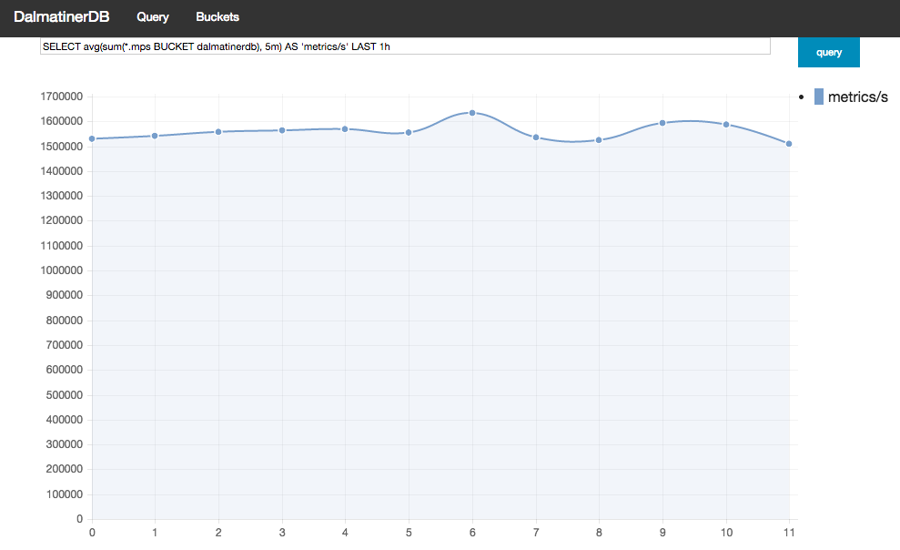
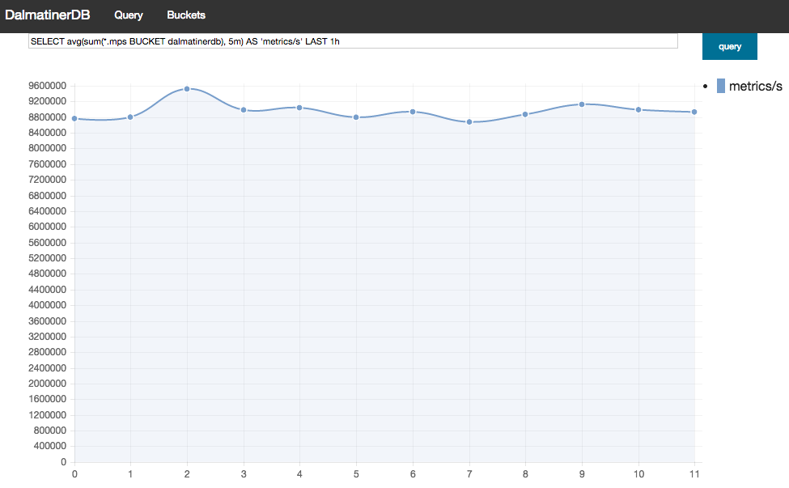

.. DalmatinerDB benchmarks, created by
   Heinz N. Gies on Sat Jul  7 16:49:03 2014.

JPC
===

This document explains the benchmark run on the JPC, it did not use live data but instead used a fork of `haggar <https://github.com/dalmatinerdb/haggar>`_ to simulate metrics. The haggar nodes are configured in a manner that overloads the DDB system, nodes are added untill more data is produced then Dalmatiner can digest.

All metrics are created on a **per second** basis and the evaluation is done on a **per second** scale as well.

The benchmarked system is also the system do aquire the result data, this demostrates that queries can be run even during overload of the DalmatinerDB System.

Once the maximum load is reached the system is keeped running until an hour of approximately stable load is recorded.

The first test is run with 1 DDB and 1 haggar VM, then slowly adding more systems.


Setup
-----

The following instances are selected

* hagger - base64 High CPU 8 (8 GB Ram, 8vCPUs, 300 GB Disk) ($423.40/month)
* ddb - highio 60.5 (61 GB Ram, 8vCPU, 1 TB Disk) ($2238.91/month)

Testing shows that 1 vCPU can sustain approximitely 1 haggar instance with 100 agents and 2000 metrics each at a flush interval of 1s.

ddb
```

The DalmatinerDB nodes are configured as follows:

.. code-block::
   bash

   pkgin install gcc47 git gmake erlang

   git clone https://github.com/dalmatinerdb/dalmatinerdb.git
   cd dalmatinerdb
   git checkout 7byte
   make stage

   cp rel/dalmatinerdb/etc/dalmatinerdb.conf.example rel/dalmatinerdb/etc/dalmatinerdb.conf

   vi rel/dalmatinerdb/bin/ddb +12 #remove line 12 (RUN_USER)
   vi rel/dalmatinerdb/bin/ddb-admin +9
   rel/dalmatinerdb/bin/ddb start

The default configuration is used with three exceptions:

* change all ``ips`` in dalmatinerdb.config to the local NIC's IP (this is required for clustering
* change ``cache_points`` form 120 to 600 to increase the ammount of memory DDB uses for caching
* cahnge distributed_cookie to something secure.

We also configure the Dalmatiner Frontend on the same node, this could go to a extra machine but for simplicity sake we keep the two on the same VM.

.. code-block::
   bash

   git clone https://github.com/dalmatinerdb/dalmatiner-frontend.git
   cd dalmatiner-frontend
   git checkout 7byte
   make stage

   vi rel/dalmatinerfe/bin/dalmatinerfe +12 #remove line 12 (RUN_USER)
   cp rel/dalmatinerfe/etc/dalmatinerfe.conf.example rel/dalmatinerfe/etc/dalmatinerfe.conf
   rel/dalmatinerfe/bin/dalmatinerfe start

haggar
``````

a precompiled binary can be downloaded form `here <https://cloudup.com/cvikDf2TcpA>`_ it is compiled from `this source <https://github.com/dalmatinerdb/haggar>`_. The shasum is ``501bf8c41dfd9b4fafcc79fc6f0232367535fa0c  haggar.ddb.bz2``.

Per hagger node we start 8 instances (one per vCPU), all instances on one hagger node connect to the same ddb node, the prefix is just a increasing number for the bucket:

.. code-block::
   bash

   screen ./haggar.ddb -agents=100 -carbon="ddb01:5555" -flush-interval=1s -jitter=1s -metrics=2000 -prefix="haggar1"
   screen ./haggar.ddb -agents=100 -carbon="ddb01:5555" -flush-interval=1s -jitter=1s -metrics=2000 -prefix="haggar2"
   screen ./haggar.ddb -agents=100 -carbon="ddb01:5555" -flush-interval=1s -jitter=1s -metrics=2000 -prefix="haggar3"
   screen ./haggar.ddb -agents=100 -carbon="ddb01:5555" -flush-interval=1s -jitter=1s -metrics=2000 -prefix="haggar4"
   screen ./haggar.ddb -agents=100 -carbon="ddb01:5555" -flush-interval=1s -jitter=1s -metrics=2000 -prefix="haggar5"
   screen ./haggar.ddb -agents=100 -carbon="ddb01:5555" -flush-interval=1s -jitter=1s -metrics=2000 -prefix="haggar6"
   screen ./haggar.ddb -agents=100 -carbon="ddb01:5555" -flush-interval=1s -jitter=1s -metrics=2000 -prefix="haggar7"
   screen ./haggar.ddb -agents=100 -carbon="ddb01:5555" -flush-interval=1s -jitter=1s -metrics=2000 -prefix="haggar8"


1 Node
``````
Running 1 haggar node (8 processes) against 1 DalmatinerDB node gives the following result:



rougly 1,500,000 metrics per second.


5 Nodes
```````

This test ran 6 hagger nodes against 5 DalmatinerDB nodes, the 6th node was writing against ddb 1, 2, 3, 4, 5, 1, 2, 3.

This configuraito uses a ``N``, ``R`` and ``W`` value of 1.

This requires deleting the ``/var/db/dalmatinerdb`` folder on the first node after shutting it down. We change the ring_size to 64 in all the config files and then join the 1st node with the remaining ones

.. code-block::
   bash

   rel/dalmatinerdb/bin/ddb-admin join dalmatinerdb@ddb01


we then checm for completion of the join opperation


.. code-block::
   bash

   rel/dalmatinerdb/bin/ddb-admin join member-status

   ================================= Membership ==================================
   Status     Ring    Pending    Node
   -------------------------------------------------------------------------------
   valid      20.3%      --      'dalmatinerdb@ddb01'
   valid      20.3%      --      'dalmatinerdb@ddb02'
   valid      20.3%      --      'dalmatinerdb@ddb03'
   valid      20.3%      --      'dalmatinerdb@ddb04'
   valid      18.8%      --      'dalmatinerdb@ddb05'
   -------------------------------------------------------------------------------
   Valid:5 / Leaving:0 / Exiting:0 / Joining:0 / Down:0




the results show between 8,500,000 and 9,000,000 metrics per second.
